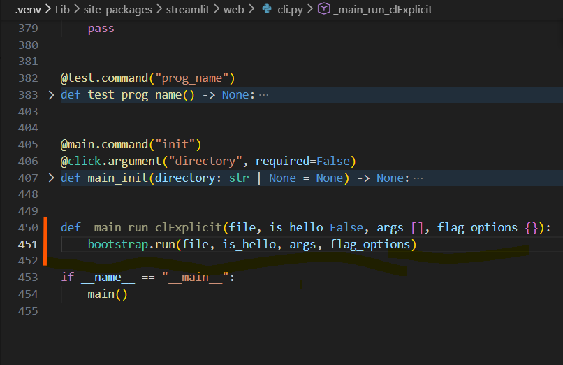

# Convertir une application streamlit en fichier .exe

Ce projet est une application simple développée avec Streamlit et transformée en exécutable Windows avec PyInstaller, pour montrer que l'on peut partager son application avec des personnes qui n'ont pas python sur leur ordi.

## Prérequis pour la création de l'exécutable

* Python 3.10+
* Streamlit
* Pyinstaller

## Étape 1 — Préparer votre environnement

```bash
python -m venv .venv
.venv\Scripts\activate
pip install -r requirements.txt
```

## Étape 2 : Créer le fichier `.streamlit/config.toml`

Crée un fichier de configuration personnalisé pour Streamlit afin de désactiver le mode développement et personnaliser le style de l'application.

Crée le fichier suivant à l'emplacement :
```plaintext
./.streamlit/config.toml
```

Avec le contenu suivant :

```toml
[global]
developmentMode = false

[server]
port = 8501

[theme]
primaryColor = "#1975fa"
backgroundColor = "#FFFFFF"
secondaryBackgroundColor = "#F0F2F6"
textColor = "#262730"

```

### Étape 3 : Générer l'exécutable

Il est préférable d'utiliser un fichier `.spec` personnalisé.

```python
# run_app.spec

# -*- mode: python ; coding: utf-8 -*-
from PyInstaller.utils.hooks import copy_metadata

datas = [('D:/streamlit_app_to_exe/.venv/Lib/site-packages/streamlit/static', 'streamlit/static'),
         ('D:/streamlit_app_to_exe/.venv/Lib/site-packages/streamlit/runtime', 'streamlit/runtime'),
         ("D:/streamlit_app_to_exe/.venv/Lib/site-packages/altair/vegalite/v5/schema/vega-lite-schema.json",
         "./altair/vegalite/v5/schema/"), 
         ('.streamlit', '.streamlit')]

datas += copy_metadata('streamlit')


a = Analysis(
    ['run_app.py'],
    pathex=['.'],
    binaries=[],
    datas=datas,
    hiddenimports=['encodings'],
    hookspath=['hooks'],
    hooksconfig={},
    runtime_hooks=[],
    excludes=[],
    noarchive=False,
    optimize=0,
)
pyz = PYZ(a.pure)

exe = EXE(
    pyz,
    a.scripts,
    a.binaries,
    a.datas,
    [],
    name='run_app',
    debug=False,
    bootloader_ignore_signals=False,
    strip=False,
    upx=True,
    upx_exclude=[],
    runtime_tmpdir=None,
    console=True,
    disable_windowed_traceback=False,
    argv_emulation=False,
    target_arch=None,
    codesign_identity=None,
    entitlements_file=None,
)

```
Compile ensuite avec :

```bash
pyinstaller run_app.spec
```

### Étape 4 : Trouver l'exécutable

Après compilation, l'exécutable se trouve ici :

```arduino
dist/run_app.exe
```

Après compilation, assure-toi que `app.py`et le dossier `dist/.streamlit/config.toml` sont copiés dans `dist/` car il est nécessaire au fonctionnement de l'exécutable.

Important : Si l'exécutable est généré avec la méthode 2 alors

Double-clique pour lancer l'application. L'interface Streamlit s'ouvrira automatiquement dans le navigateur.

Il ne vous reste plus qu'à transmettre le dossier dist/run_app/ à vos collègues.
Ils pourront lancer l'application sans installer Python ni aucune dépendance.

> Résultat : votre app Streamlit devient utilisable par tout le monde, immédiatement et sans friction.

## Dépannage

### Erreur "Module not found"

Ajoute le module manquant via l'option `--hidden-import` :

```bash
--hidden-import nom_du_module
```

### Fichiers/dossiers non trouvés à l'exécution

Assure-toi de les inclure via :

```bash
--add-data "chemin/vers/dossier;nom_dossier"
```

Ou via la section `datas` du fichier `.spec`.

### Problèmes de chemins dans le code

Utilise des chemins absolus basés sur le fichier actuel :

```python
import os
BASE_DIR = os.path.dirname(os.path.abspath(__file__))
path = os.path.join(BASE_DIR, "dossier", "fichier.html")
```

### L'application se lance mais rien ne s'affiche (ou ne se lance pas du tout)

Si ton application Streamlit s'exécute sans message d'erreur mais que rien ne s'affiche dans le navigateur, le problème peut venir de la fonction d'exécution interne du module `cli.py`.

#### Étapes de correction

1. Ouvre le fichier suivant dans ton environnement virtuel :

```bash
.venv/Lib/site-packages/streamlit/web/cli.py
```
2. Ajoute le code suivant dans le fichier `cli.py`, à l'emplacement indiqué sur l'image ci-dessous :

```python
def _main_run_clExplicit(file, is_hello=False, args=[], flag_options={}):
    bootstrap.run(file, is_hello, args, flag_options)
```

Exemple d'emplacement du code ajouté : 


3. Une fois la modification enregistrée, reprends la procédure à partir de l'étape suivante :

* Etape 3 : Générer l'exécutable

```bash
pyinstaller run_app.spec
```
---

## Distribution

Pour distribuer l'application :
1. Copier `app.py` dans `dist/`
2. Récupère `run_app.exe` dans `dist/`
3. Crée une archive `.zip` ou copie sur une clé USB
4. Aucun besoin d'installer Python sur le PC cible
5. L'utilisateur n'a qu'à double-cliquer sur le fichier `run_app.exe`